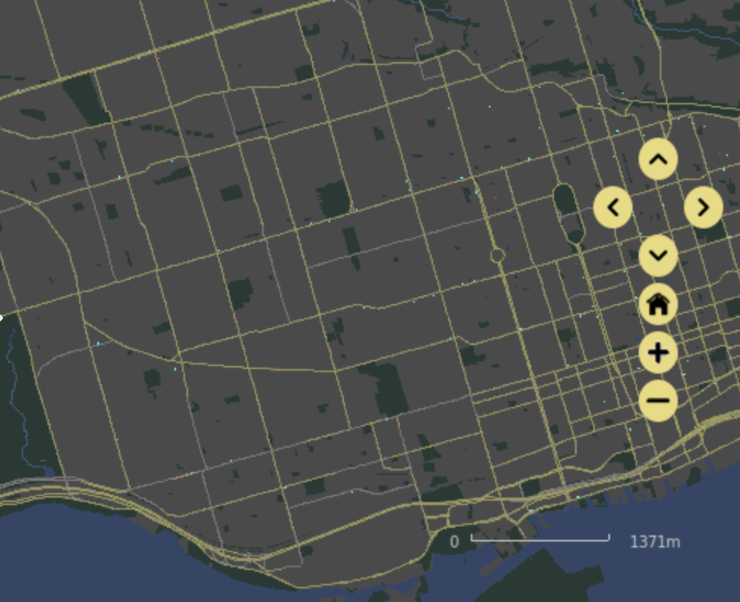
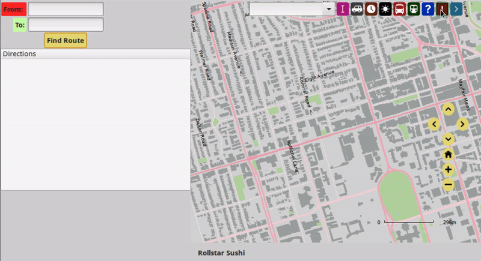
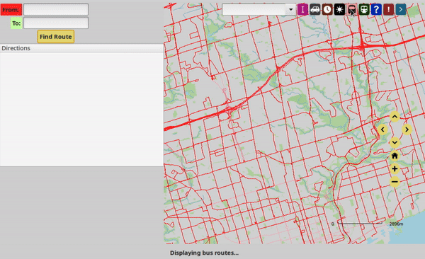
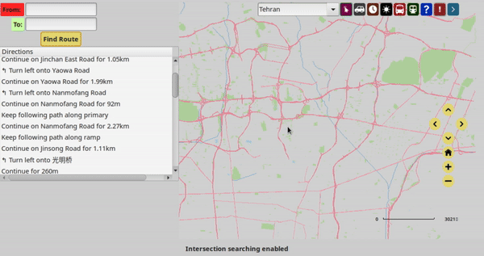

# HerWay
With more than half of women reporting that they feel unsafe while traveling at night, HerWay is a mapping application designed specifically to help women get home both quickly and safely. It was created in C++ using data from OpenStreetMap (OSM) database with a graphical user interface (GUI) built with setups and callbacks from [GTK](https://docs.gtk.org/) and styled using the [EZGL](https://ug251.eecg.utoronto.ca/ece297s/ezgl_doc/index.html) library and traditional CSS. Performance was optimized using multithreading and by pre-loading data from the OSM database into large data structures from the C++ STL (maps, vectors, etc.). 

Note: This map was created for Software Design and Communication (ECE297) at the University of Toronto. As such, all code is in a separate, private repository to avoid plagarism and is available upon request. A copy of the slides used for the final presentation is externally available [here](https://docs.google.com/presentation/d/1rBmUW8rLhqVlzK6LNSPRxFUlWmQcqsgYzBfIrxKKGQI/edit?usp=sharing) or within the repository as a pdf under `team028-pitch.pdf`.

# Notable features
The map contains several key GUI features (detailed below) that allow users to quickly and easily navigate throughout a given city. 

## Well-lit streets
HerWay highlights streets with the well-lit OSM tag in bright yellow when the map is used in dark mode. 

## POIs 
When the crisis ("!") button is clicked, HerWay selectively displays important POIs (shelters, healthcare facilities and police/emergency services), regardless of zoom level. However, when unclicked, POIs are displayed only when sufficiently zoomed in, and a wider array are displayed using OSM icons. POI names are visible in the status bar when hovered over.

## Public transit & location changes
With the majority of public transportation users identifying as women, HerWay display both bus and subway routes on toggle. Stations near intersections are also displayed using green (bus) and orange (subway) icons.

This functionality expands to multiple cities. Using a drop-down menu, users can visit a selection of different cities and view their subway/bus routes as applicable. 

## Searching methods 
HerWay uses 2 main methods for searching: intersection-clicking and an autocomplete search bar. Users can click on or select any 2 intersections or POIs and find the shortest path between them. 

## Wayfinding modifications 
Users can toggle between travel modes using a button. Depending on the transportation mode, HerWay will generate alterative routes with clear directions and approximate travel times. There are 3 modes to select from: 
-  Car - includes all roads, highways, etc.; shortest route generated based on travel time (using speed limit of roads)
- Walking - includes only walkable streets, no highways; shortest route generated based on distance 
- Walking with crisis button toggled - similar to above, but only includes streets tagged as 'well-lit'

# Algorithmic complexity 
**Dijkstra's algorithm** was used to compute the shortest path (based on time or distance) between any 2 nodes. 

We also implemented a variation of the **traveling salesman problem (NP-hard)** to allow for pick-ups and drop-offs (so long as the start/end 'depot' was the same) as well. Generation of a valid route was implemented using multi-target Dijkstra, with travel times between all pick-ups/drop-offs/depots stored in a matrix (n x n array). This generated a valid route by always selecting the closest node. 

To generate the most optimal route within a given computation limit (50 s), we used: 
* Generation of a valid route for all depots using multi-target dijkstra
* Greedy algorithm (selected 2nd closest node 0-5% of the time) - ran ~10,000 times for each of the starting depots, selected the best 1000 routes
* 2-opt (randomly swapped 2 edges of any route) - ran up until 8 seconds below run-time (measured using `std::chrono`) to maximize the numebr of swaps performed
